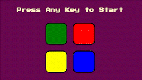

# Memory Game 

🕹 Demo: <a href="https://halazbib22.github.io/challenge_JS/" target="_blank">Memory Game Project</a>

This project was developed using javascript. ( Code includes jQuery )

* The game only starts when you press a key on the keyboard
* The whole game is based on a pattern and the user should memorize the pattern throughout the levels
* The game should never end 
* The game sounds are inside the project directory

---

